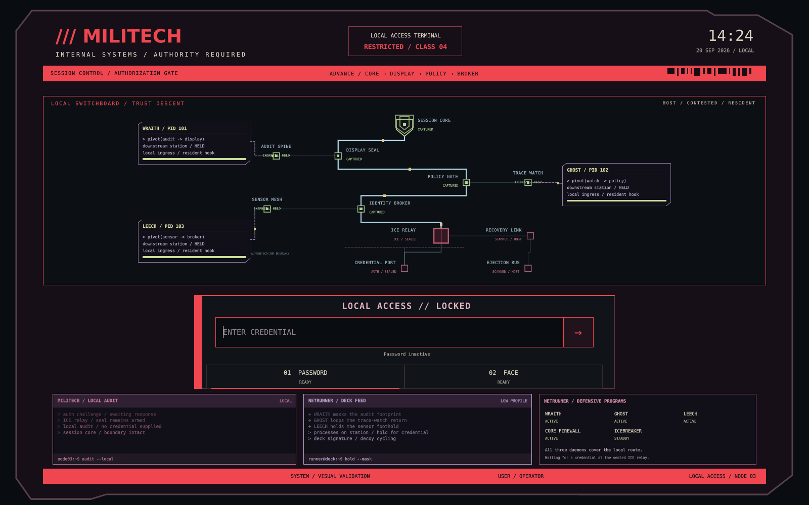

# Session Stack

A Cyberpunk/Militech screen for locking a Hyprland desktop or signing in through
an optional greetd greeter. Both use the same native QuickShell interface. PAM
owns lock authentication; greetd owns login and session launch. Animation and
recovery cannot grant access.



## Compatibility

This is an experimental release for Arch Linux with Hyprland's Lua configuration
API, Qt 6.11 and patched QuickShell 0.3.0. Other environments have not been tested.

Start with the preview. Before using it as your regular lockscreen, follow the
[setup and recovery checks](docs/lockscreen.md#before-enabling-automatic-locking).
Keep a working TTY login and Hyprlock available during those checks.

## Try it

Clone this repository or use GitHub's **Code > Download ZIP** and extract it to a
permanent directory. Preserve the `common` symlinks inside the QuickShell entry
points when extracting. Install the
[dependencies](docs/lockscreen.md#dependencies-and-setup), then run as your
desktop user from that directory:

```sh
./session-stack preview
./session-stack login-preview  # Full package only
```

These windows use no real authentication. Wake the screen and enter `demo` for
success, or another word for rejection. ICEbreaker recovery returns to credential
entry. The lock preview also supports F5/F6 for success/failure and paused scene
inspection through IPC.

For a usable lockscreen, follow [lockscreen setup](docs/lockscreen.md), then run:

```sh
./session-stack auth-check
./session-stack check
./session-stack lock
```

`auth-check` uses real PAM in an ordinary window. `lock` secures the compositor.
Password is the default. For a machine with Face ID and no fingerprint reader:

```sh
SESSION_STACK_AUTH_METHODS=password-face ./session-stack auth-check
SESSION_STACK_AUTH_METHODS=password-face ./session-stack lock
```

Copy `lock.toml` to `lock.local.toml` to save your choice. Set `face = "auto"` and
leave `fingerprint = "off"`. Auto detection checks the backend, device and account
enrollment before offering a method. Login has its own `greeter.local.toml` and
resolves capabilities for each account when staged.

For fingerprint readers, enable `fingerprint = "auto"` in `lock.local.toml`.
If fingerprint disappears when launched through UWSM or a user service, read
[fingerprint setup under UWSM](docs/lockscreen.md#fingerprint-under-uwsm).
The optional permission is never installed by the normal PAM setup.

## Choose what to install

The lock package runs on its own. It has no greetd controller, login PAM module,
account discovery or login deployment scripts. Nothing here changes your login
manager merely by running a preview or setting up the lockscreen.

The full package adds a user picker, manual username entry, session selection,
and greetd session launch. Its installation and ReGreet rollback instructions
are in `docs/login.md`. Login activation is explicit and separate from lock setup.

Both modes share wake-key typing, a credential draft across outputs, idle
clearing, portrait layout, reduced motion and the switchboard animation.
Additional authentication prompts stay in the existing PAM conversation.
Escape clears input. Recovery stays locked and replaces destroyed processes.

## Development

See [development notes](docs/development.md) for ownership, checks and exports.
See the [changelog](CHANGELOG.md) for fixes and remaining release checks.
No framework or browser runtime is needed.

The automated checks cover authentication state, input, greetd protocol exchanges
and isolated installation/rollback. They do not replace testing with real PAM,
the compositor and your hardware.

## License

Project code is [MIT licensed](LICENSE). This is an unofficial fan project.
See [third-party notices](THIRD_PARTY.md) for references and dependency licenses.
